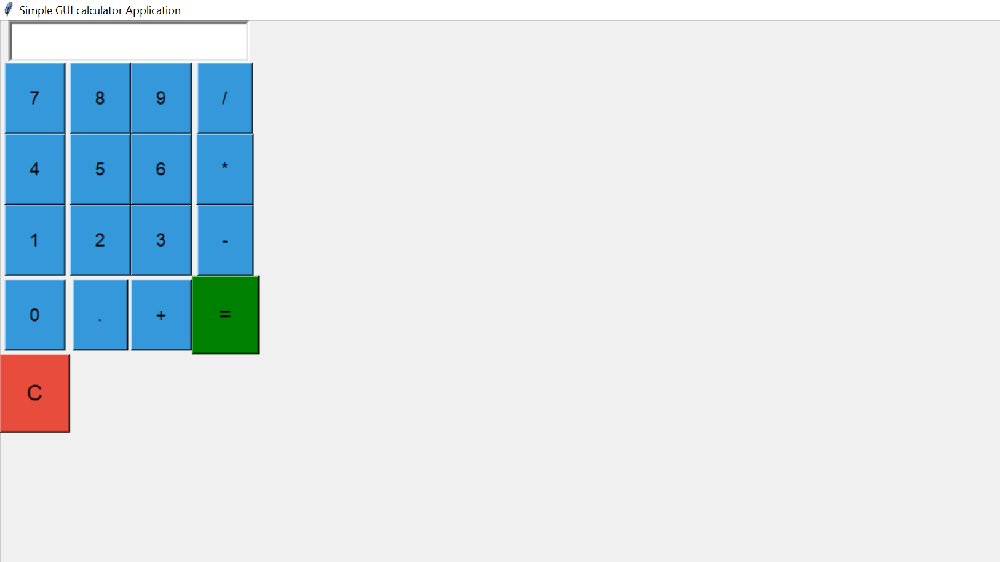

# 🧮 Desktop Calculator App – Built with Python & Tkinter

> A simple yet functional calculator application designed using Python’s Tkinter library.

---

## ✨ Why Create This?

> "Why create this? Simple – for beginners to grasp content and the basic flow of data,  
since it does not require big data manipulation. No database is needed."  
> 
> — *dancan mungafu alwavega*

This project serves as a learning bridge for understanding:

- GUI development basics in Python
- Data flow through user input → processing → display
- Event-driven programming with Tkinter
- How Python can be used outside the web

---

## 💡 Highlights

- 📦 **No database required** – makes it lightweight and beginner-friendly  
- 🎨 **Graphical User Interface** – built with Tkinter, Python’s native GUI library  
- 🐍 **Built in Python** – open-source, versatile, and fun to use  
- 😂 **Named after Comedy** – Yes, Python is named after “Monty Python’s Flying Circus”!

---

## 🛠 Tech Stack

| Tool | Description |
|------|-------------|
| 🐍 Python | The core programming language |
| 🖥 Tkinter | Standard Python module for building desktop UIs |
| 🧠 Python IDE | Used for writing, testing, and running the app |

---

## 🖼 Screenshot

> *(Add a screenshot of your running calculator app here)*  


---

## 🚀 How to Run It

```bash
# Clone the repository
git clone https://github.com/yourusername/desktop-calculator-python.git
cd desktop-calculator-python

# Run the app
python calculator.py
